## Purpose of the project
* The Gem in the Tower is an old school adventure text base. It will be used to practice python and apply OOP principles
* The purpose of the game is ascend the tower and reclaim the Gem from the final enemy.
## User stories
* A user wants to play the game. [Issue Tracker](https://github.com/rfpotrero/The-Gem-in-the-Tower/labels/Main_Game%20_Fuction)
* A user can progress via the game. [Issue Tracker](https://github.com/rfpotrero/The-Gem-in-the-Tower/issues?q=is%3Aissue+label%3Agame_progress+)
* A user can fight any creature that appear. [Issue Tracker](https://github.com/rfpotrero/The-Gem-in-the-Tower/issues?q=is%3Aissue+label%3A%22Main+Fight+Loop%22+) 
* A user can choose in game actions. [Issue Tracker](https://github.com/rfpotrero/The-Gem-in-the-Tower/issues?q=is%3Aissue+label%3Ain_game_actions+)
* A user will be able to select and action after an encounter [Issue Tracker](https://github.com/rfpotrero/The-Gem-in-the-Tower/issues?q=is%3Aissue+label%3Ain_game_actions)
## Flow Diagrams
### First milestone.
* This diagram shows the basic skeleton of the program and the minium objectives that the project should deliver. This is a functionnal yet basic game.

### Complete Flow Diagram
* The complete diagram shows below display final flow of the game. Uses the skeleton in the first milestone but expand it allowing the player to take actions and randomly triggering encounters depending on the users input. 
* The descriptions for each floor are decoupled and store those descriptions in a functions.py file to allow modifying or expand without impacting the core functionalities.
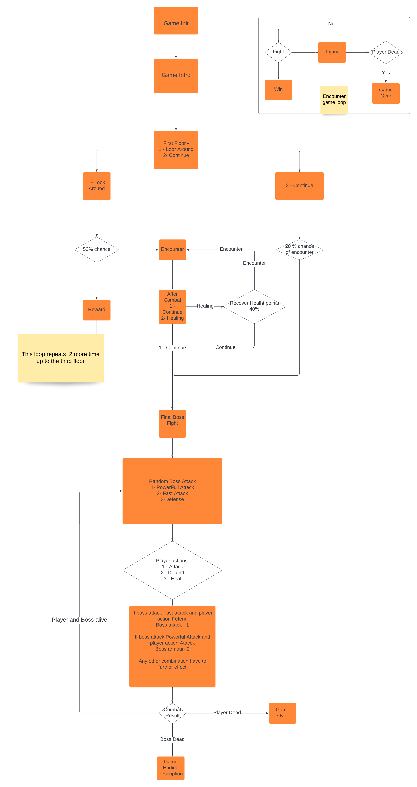
## Features
* Playing a game.
* Select the action while fighting. 
* Select the action after a fight happen.
* Choose beteween continue or explore for a chance of get a reward.
* Complete the game by defeating the final boss.
## Future features
* Introduce different type of rooms 
* Introduce different type of monsters
## Technology
* Python 
  - The programming language for this exercecise is Python.
* Heroku 
  - Heroku is the platform used to deploy the program and make it accessible to the general public
* Github
  - Github was selected as the version control 
* Lucichart
  - Lucichart was used to desing the flow diagrams.
## Test cases
* User starts a game. 
- User visit local host or Heroku app link
  - Expected behaviour: The user will be presented with the game banner. 
    - **Passed**: Upon loading the game displays the game banner with the correct colour style
    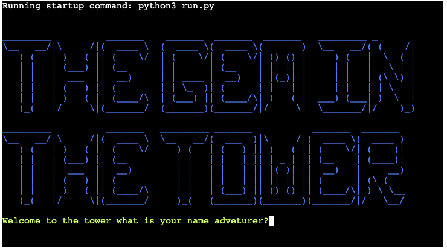
  - Expected behaviour: The game will load and the user will be able to enter a name. Validation will ensure only letters are used in the name.
    - **Passed**: The user is able to selec the name. Validation ensures only characters ares used in the name. 
  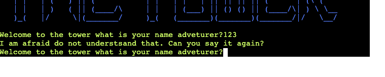 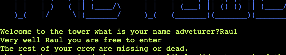
* User select what do during a fight. 
  - Expected behaviour: A user can select Attack, Defend or Heal during an encounter (1, 2, 3)
    - **Passed**: User is able to see the combat menu  
    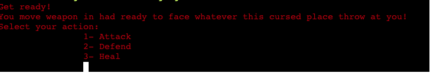
  - Expected behaviour: The user will see the result of the action, an incorrect entry will trigger a message stating that the entry is incorrect. 
    - **Passed**: Input validation  
    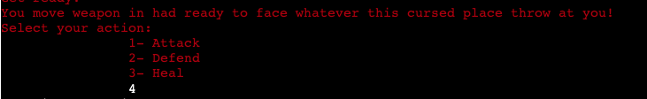
    - **Passed**: Action one is recognised and the program display the attack roll outputtin if success or not
    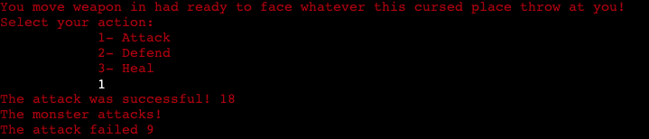
    - **Passed**: Action two is recognised and the program display the correct description  
    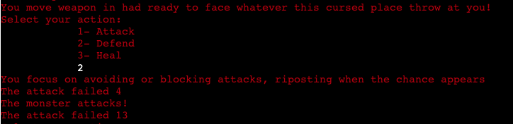
    - **Passed**: Action three is recognised by the program and additional validation is done to check if the health points are currently at maxium 
    
* User can choose to explore for a chance of getting a reward
  - Expected behaviour: A user can select one or two in order to continue or risk an encounter to gain a reward. 
    - **Passed**: Validation is successful, only 1 or 2 are valid options. 
    
    - **Passed**: After selecting the option to continue searching an encounter is triggered
    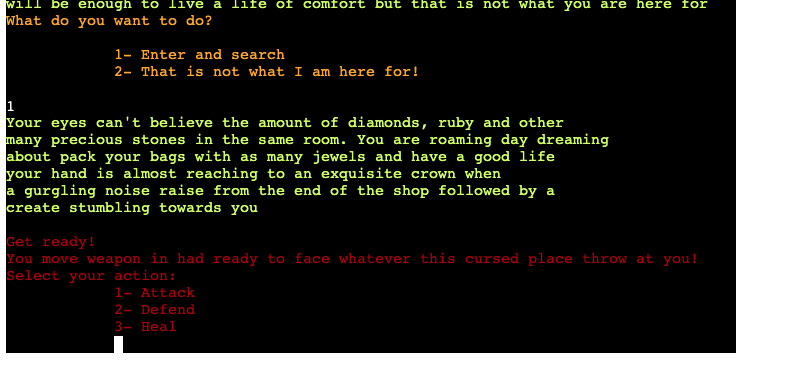
* User selects what happen after a fight
  - Expected behaviout: After a fight the user can continue or recover their health point (1, 2). Recovering the health points have 40% chance of trigger an encounter.
    - **Pass**: The after fight menu appears after the fight ends and the player have over 0 Health Points
    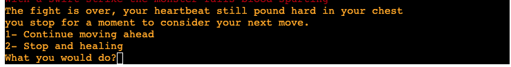 
    - **Pass**: After input 1 the program continues to the next scene
    
    - **Pass**: After input 2 the program display the text for heal and if no encounter is trigger it will continue the program
    
* User complete the game defeating the final boss
  - Expected behaviour: After bringing the last boss's health points to zero the user will complete the game seeing the last description. 
    - **Pass**: After bringing the final boss to zero health points the game displays the game ending text
    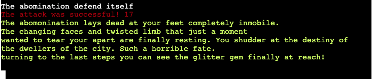
* The game end when the user Health Points reach zero
  - If at any point the player's Health Point reach zero the game end inmediatly displaying the game over message. 
    - **Passed**: When the player reach zero health points the game ends displaying the game over message. 
    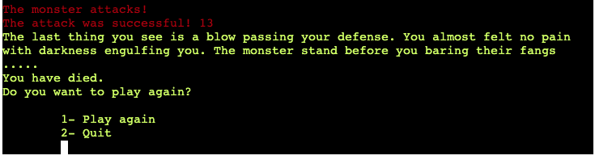
## Code validation
* Python Coding validation
## Fixed bugs
* Fixing bug UnboundLocalError in attack_roll function [Issue21](https://github.com/rfpotrero/The-Gem-in-the-Tower/issues/21)
* Fix input validation in encounter funciton [Issue27](https://github.com/rfpotrero/The-Gem-in-the-Tower/issues/27)
## Deployment
* Heroku Deployment 
  - Navigate and login to Heroku and login it 
  - Click in Settings, under builpacks select: 
    - Python, NodeJS in this order first Python, second nodejs 
  - In Config Vars click in Add and add the following
    - PORT , 8000
  - Once that is completed. Click in Deploy
    - In Deploy Method clink under GitHub 
    - Connect your Github repository to Heroku
    - At the bottom under Manual Deployment select the Branch you want to deploy. Most likely main
    - Click in Deploy Branch
* Local deployment
  - Execute in terminal node index.js inside the project's folder
  - If there is any erro we will need to install further modules. The most common total, in the terminal entry npm install total
  - Execute again node index.js 
  - By default it uses local host port 8000 . Naviagate in your browser to http://localhost:8000/ 
  - Click in run program if the program do not start automatically
## Credits